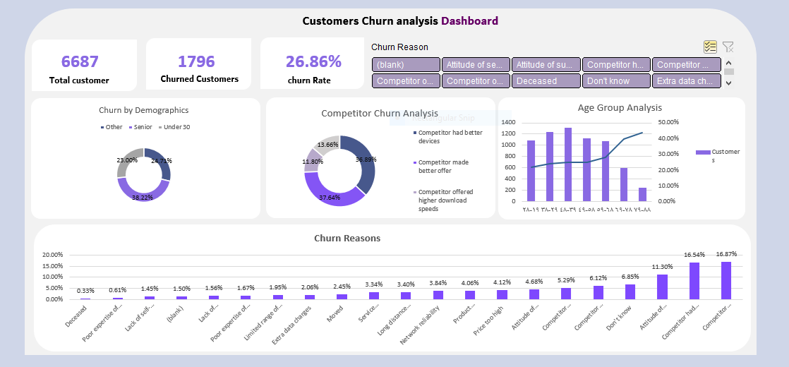

# # Customers Churn Analysis Dashboard

## 📋 Project Overview
The **Customers Churn Analysis Dashboard** is a data analytics project designed to identify, visualize, and understand the reasons behind customer churn.  
It provides insights into customer behavior, churn demographics, competitor impact, and the main factors influencing customer loss.  

This dashboard helps companies make data-driven decisions to **reduce churn rates**, **improve customer retention**, and **optimize service quality**.

---

## 📊 Key Metrics
- **Total Customers:** 6,687  
- **Churned Customers:** 1,796  
- **Churn Rate:** 26.86%

---

## 🧩 Dashboard Features

### 1. Churn by Demographics
- Analyzes churn across different age groups: **Under 30**, **Senior**, and **Other**.
- Helps understand which customer segments are more likely to leave.

### 2. Competitor Churn Analysis
- Identifies the main competitive reasons for customer churn:
  - Competitor offered better devices.  
  - Competitor made better offers.  
  - Competitor offered higher download speeds.
- Provides actionable insights to improve market competitiveness.

### 3. Age Group Analysis
- Bar and line chart visualizing the relationship between **age groups** and **customer churn**.
- Highlights which age ranges are most at risk of leaving the service.

### 4. Churn Reasons
- Displays top reasons customers stopped using the service:
  - High prices  
  - Poor network reliability  
  - Service issues  
  - Attitude of support staff  
  - Competitor influence  
- Enables targeted actions for service and pricing improvements.

---

## ⚙️ Tools & Technologies
- **Microsoft Excel** – for data cleaning, analysis, and dashboard creation  
- **Power Query** – for transforming and preparing datasets  
- **Pivot Tables & Charts** – for visualization  
- **Conditional Formatting & Slicers** – for interactivity and filtering

---

## 🧠 Insights & Business Impact
- The **churn rate (26.86%)** suggests significant customer loss requiring retention strategies.  
- **Younger customers (under 30)** show a notable churn pattern, possibly linked to price sensitivity.  
- **Competitor offers** and **service quality issues** remain leading factors behind churn.  
- Addressing **pricing concerns** and improving **support interactions** could reduce churn.

---

## 🚀 Objectives
- Understand customer churn patterns across different demographics.  
- Identify key drivers of customer loss.  
- Provide actionable insights to support **customer retention strategies**.  

---

## 👩‍💻 Author
**Data Analyst:** *Nagat El-Zeny*  
🔗 [GitHub Repository](https://github.com/Nagat-elzeny)  
📫 *Contact:* [LinkedIn](https://www.linkedin.com/in/nagat-elzeny-651584357/) | [Email](nagatshaker79@gmail.com)

---

## 📁 Repository Structure
